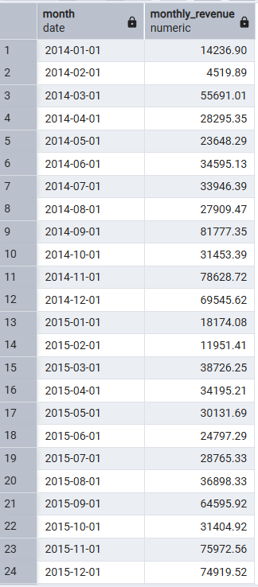
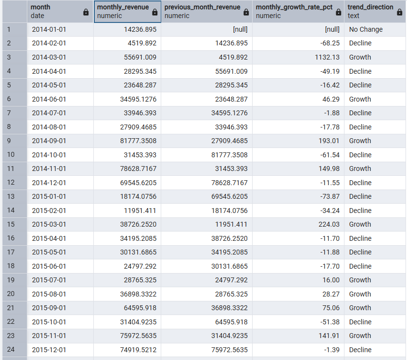
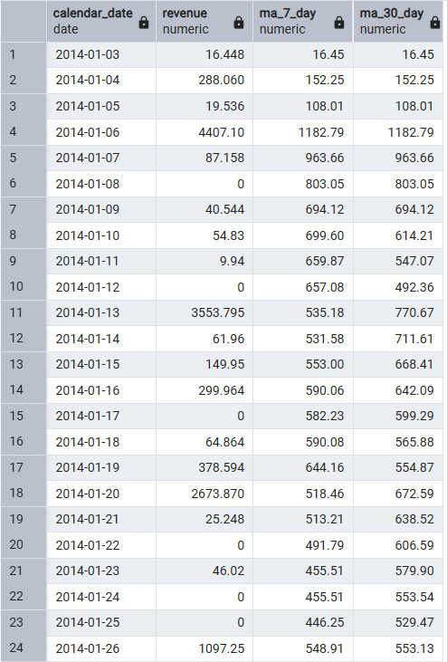
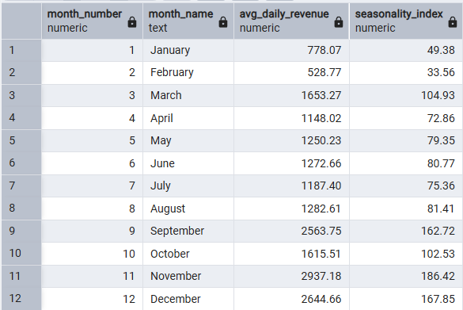

# 📊 SQL Sales Trend & Seasonality Analysis

## 📌 Project Overview

This project analyzes retail sales data using PostgreSQL to identify trends, growth patterns, and seasonality in business performance.

The objective is to demonstrate how SQL can be used for end-to-end analytical workflows, including time-series analysis and business metric evaluation.

---

## 🗂️ Dataset

- File: `data/superstore.csv`  
- Source: Superstore Sales Dataset  
- Records: ~10,000 rows  
- Time Period: 2014 – 2017  

### Key Fields:
- order_id  
- order_date  
- customer_id  
- product_id  
- product_name  
- sales  
- profit  

---

## 🔄 Project Workflow

### 1. Data Import
- Imported raw CSV data into PostgreSQL  
- Date columns were initially stored as text due to formatting inconsistencies  
- Converted to proper `DATE` format during cleaning  

---

### 2. Data Profiling
Performed initial data exploration to understand structure and quality:

- Row count and dataset size  
- Date range validation  
- Distinct value checks  
- Duplicate detection  
- Missing value analysis  

---

### 3. Data Cleaning
- Converted string date fields using `TO_DATE()`  
- Removed duplicate records  
- Ensured consistency in data types  

---

### 4. Time Series Preparation
- Created a **calendar table** using `generate_series()`  
- Built a continuous date range to include missing dates  
- Used `COALESCE()` to handle zero-sales days  

---

### 5. Trend Analysis
Calculated daily revenue and applied moving averages:

- 7-day moving average  
- 30-day moving average  

These metrics help smooth short-term fluctuations and reveal underlying patterns.

---

### 6. Growth Analysis
Calculated key business growth metric:

- **Month-over-Month (MoM) Growth**

This measures how sales performance changes over time and highlights periods of growth and decline.

---

### 7. Seasonality Analysis
Identified recurring patterns using **Seasonality Index**:

**Formula:**

Seasonality Index =  
(Average Daily Revenue for Month / Overall Average Daily Revenue) × 100  

**Interpretation:**
- Index > 100 → Above-average performance  
- Index < 100 → Below-average performance  

This helps identify high-demand and low-demand periods.

---

## 📊 Key Analysis Outputs

### 📈 Monthly Sales Trend
Displays total monthly revenue over time, forming the baseline for trend analysis.

---

### 📊 Monthly Growth Analysis
Shows month-over-month growth rate and identifies periods of growth and decline.

---

### 📉 Moving Average
Applies rolling averages to smooth short-term fluctuations and highlight trends.

---

### 🔁 Seasonality Index
Highlights seasonal demand patterns across different months.

---

## 🧠 Key SQL Concepts Used

- Window Functions (`AVG() OVER`, `LAG()`)  
- Moving Averages  
- Date Functions (`DATE_TRUNC`, `EXTRACT`)  
- CTEs (Common Table Expressions)  
- Views  
- Aggregations  
- Time Series Analysis  

---

## 📈 Key Insights

- Sales show high volatility with no consistent long-term upward trend  
- Month-over-month growth fluctuates significantly across the timeline  
- Revenue is driven by intermittent spikes rather than steady growth  
- A strong seasonal pattern is observed starting from **September**  
- Peak sales occur during **November and December**  
- Sales activity is concentrated in **late Q3 and Q4**  

---

## 📁 Project Structure

sql-sales-trend-seasonality-analysis/
│
├── data/
│ └── superstore.csv
│
├── screenshots/
│ ├── monthly_sales_trend.png
│ ├── monthly_growth_analysis.png
│ ├── moving_average.png
│ └── seasonality_index.png
│
├── sql/
│ ├── 01_data_import.sql
│ ├── 02_data_profiling.sql
│ ├── 03_data_cleaning.sql
│ ├── 04_time_series_preparation.sql
│ ├── 05_moving_averages.sql
│ ├── 06_monthly_growth_analysis.sql
│ ├── 07_seasonality_detection.sql
│ └── 08_business_insights.sql
│
└── README.md

---

## 🚀 Project Outcome

This project demonstrates how SQL can be used not only for data extraction but also for advanced analytical workflows, including:

- Trend analysis  
- Growth measurement  
- Seasonality detection  

For detailed analysis, refer to the `08_business_insights.sql` file.

---

## 👤 Author

**Saumya**  
📧 ysaumya195@gmail.com  
🔗 www.linkedin.com/in/saumya-data-analyst

